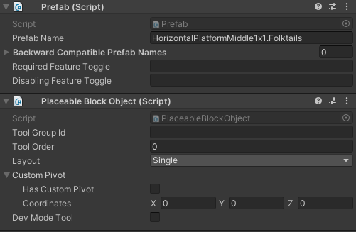

# Bottom bar
{: .no_toc }

## Table of contents
{: .no_toc .text-delta }

1. TOC
{:toc}
  
TimberApi has reworked the bottom bar to work alongside the [`Tool`](/tools) and [`ToolGroup`](/tool_groups).
This gives mod creators and mod users more customization options.  

The implementation will provide the following features for the bottom bar:  
**NOTE: This feature is NOT available for the map-editor**
- Customizable Tool/Group order
- Customizable styling
- Customizable title/description (for most in game buttons)
- Customizable dev mode toggle
- Customizable icon
- Unlimited layered groups
- Multiple first row sections
- Hide existing Tools/Groups

## Add buildings
1. Add the scripts `Prefab` & `PlaceableBlockObject` to the building.

2. Fill in the `Prefab Name`, this will become the `id` of the specification.
3. Fill in the `Tool Order` at which position the tool should be placed.
4. Optionally, fill in `Tool Group Id` with the `id` of the `ToolGroupSpecification`.
5. Optionally, enable `Dev Mode Tool` if it's a tool for development.

{: .no_toc }
### Notes
- TimberApi will increase the `Tool Order` with a x10 to create space for adding groups.
- If you want to change the layout or other aspects check out Add custom tools. and edit your Tool without the `.override` addition.

## Add groups
Add the following file as an `ToolGroupSpecification`  eg. `Other.ToolGroupSpecification.original.json`
```json
{
    "Id": "Other",
    "GroupId": "Optionally",
    "Order": "180",
    "NameLocKey": "ToolGroups.Other",
    "Icon": "Sprites/BottomBar/BuildingGroups/Other"
}
```
### Notes
{: .no_toc }
- Remove the `GroupId` if you want to have it on the bottombar
- For more detailed information checkout ToolGroups

## Specification information
### ToolSpecification
The BottomBarSection defines the area where the buttons are located on the first row.

```json
{
  ...
  "ToolInformation": {
    "BottomBarSection": 1
  }
  ...
}
```
### ToolGroupSpecification
```json
{
  ...
  "GroupInformation": {
    "BottomBarSection": 1
  }
  ...
}
```
